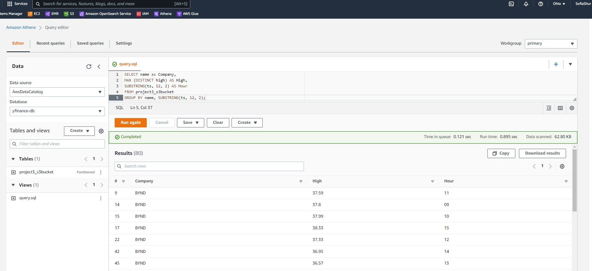

**Streaming Finance Data with AWS Lambda**

**CIS9760:  Big Data Technology**    

**Project 3: ** **by Sofia Shur**										

**Due Date:**  **5/24/2022**

[TOC]

**Overview**

​	The real time yahoo finance data has been streamed with AWS Lambda function and Kinesis.  Generated finance data records on selected companies have been used for running queries and performing analysis in the AWS Athena, Glue and Jupyter Notebook.

##### **Objective** 

​	To demonstrate student's ability and knowledge in the AWS Lambda (DataTransformer), Kinesis (DataCollector), Glue (DataIntegration), Athena(DataAnalyzer) by leveraging professional or personal endeavors that require consumption of data that is “always on” and changing very quickly.

##### **Technology**

Utilized AWS services and software as a serverless architecture for this project using finance data on the following companies:

Facebook (FB)
Shopify (SHOP)
Beyond Meat (BYND)
Netflix (NFLX)
Pinterest (PINS)
Square (SQ)
The Trade Desk (TTD)
Okta (OKTA)
Snap (SNAP)
Datadog (DDOG)

**Steps:**

1) *Data Streaming and Collection*

- Set up S3 bucket to collect the data stream
- Create s Kinesis Stream holds the streamed data
- Create AWS Lambda to gather the streamed data
  - add a custom lambda layer
  - change the basic configuration settings of lambda function

- Set up a Kinesis Delivery Stream to hold the streamed data

2) *ETL Process and Analysis* 

- Configuring a Glue Crawler
- Connect Glue Crawler and Athena to S3 bucket with data stream records
- Running queries in Athena’s interactive querying shell 

3. *Data Visualization* 

- Export the query results from Athena
- Import to Jupyter Notebook to generate visualizations

##### **Requirements**

Execution Results in AWS Lambda Management Console :

AWS Kinesis configuration page:

Kinesis Firehose delivery stream/S3 bucket:

****

The screenshot of the results from AWS Athena

##### **Assignment**

To generate a real time data pipeline for finance data records for interactive querying.

##### 	**Infrastructure**

This project consists of four major infrastructure elements: Data Transformer, Data Collector, Data Analyzer, and Data Visualization.

##### 	**Data Transformation** and Collection

Creating a Kinesis Delivery Stream and writing a lambda function that gathers and holds the data. 

##### 	**Data Analysis**

 Setting up a Glue crawler that helps to run AWS Athena queries on gathered data.

##### **Data Visualization**

Using query results to generate two visualizations.
